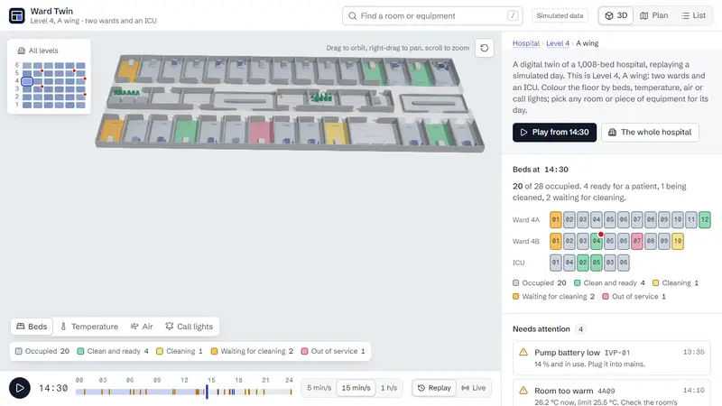

# Ward Twin

[](https://github.com/imsemoo/ward-twin/actions/workflows/deploy.yml)

A concept digital twin of a hospital, in the browser: six levels of six wings, with 1,368 rooms, 1,008 beds and 3,006 tracked pieces of equipment. It opens on one wing, two wards and an ICU on level 4, and replays a simulated day, or follows it live from a streaming feed: beds turning over from occupied to cleaning to ready, rooms warming up through HVAC faults, call lights waiting too long at shift change, and equipment moving between rooms.

Everything on screen is simulated. There is no real hospital, patient or reading behind it.



The full film, 40 seconds, goes on to the way to the nearest free pump, the whole hospital and a level: [film/ward-twin-720.mp4](film/ward-twin-720.mp4), captured frame by frame on a controlled clock by `tools/film`.

**Live:** https://imsemoo.github.io/ward-twin/ (add `?stats` for a frame meter, or open [live mode](https://imsemoo.github.io/ward-twin/?mode=live))

## What it does

- **The whole hospital, a level, or a wing.** A map of the building sits beside the model: every wing by level, shaded by how full it is, with a mark where something critical is open.
  - "All levels" draws the six levels apart, an exploded section of the building, with every floor coloured by the same layers; a warm room or a stale lounge shows from across the hospital.
  - A level shows its six wings on one plate, joined by glazed links, in 3D or as one floor plan.
  - A click on a wing flies into it, and a trail above the panel leads back up: Hospital, Level 4, A wing.
- **3D, plan and list views of the same floor.** Plan view drops every wall to a section cut 15 cm above the floor and inks it, so the model turns into the architect's drawing without swapping scenes. List view is the same data as an accessible table.
- **Four data layers on the floors:** bed state, temperature, CO₂ and call-light wait time, each with its key. In temperature and CO₂ each room shows its own sensor, and the corridors, which have none, are estimated from the doors that open onto them, with isolines and a darker line at the alert limit: a warm room's heat shows spilling out of its door, and a stale lounge's air down the corridor.
- **A 24-hour replay** with play, three speeds and a scrubber marked with every alert.
- **Or live.** Live mode connects to a feed and builds the floor from events as they arrive. In the demo, a mock server in a Web Worker streams the simulated day at a simulated minute a second, over the JSON protocol a real integration server would use. The footer shows the connection. "Take the server down for 4 seconds" shows the recovery: retries back off, the stage says the floor is stale, and the missed events are replayed on reconnect.
- **The nearest free equipment, and the way to it.** From any bed, "Nearest free" finds the pump, wheelchair, bladder scanner or, in the ICU, ventilator that is quickest to reach on foot anywhere in the hospital, and draws the way on the floors with the walking time. When the nearest one is in another wing the view pulls out to the level, and to the whole hospital when the way takes a lift.
- **Pick anything:** click a room or a piece of equipment, or search for it with `/`. The camera flies to it and the side panel shows its day: bed states as a strip, 24-hour temperature and CO₂ charts with limits, call lights, and the equipment in the room.
- **Every view is a link.** The address bar keeps the view, layer, time and selection, so `?view=plan&layer=air&t=18:00&select=FAM` opens the family lounge at its stuffiest hour, `?at=level-4` a whole level and `?at=hospital` the whole hospital.
- **Alerts that only know the present.** Each alert is worded at the replay minute ("Pressed at 14:21, 9 min without an answer"), so scrubbing never leaks what happens next.

## How it is built

- React 19, TypeScript, React Three Fiber, drei and three.js, bundled with Vite.
- **The day is generated in a Web Worker** from a fixed seed, so the scene's first frame never waits on the simulation and every visitor replays the same day.
  - Each wing is simulated from its own seed, so one wing's day never shifts another's. Level 4's A wing keeps a scripted story on top; the others draw their discharges, admissions and faults at random.
  - The wing on show arrives first, in under 30 ms, and the whole hospital follows in under a second (measured at 25 to 29 ms and 0.6 to 0.75 s on the laptop below).
- **One day, two sources.** Every view is a function of a day and a minute. Replay hands the views the recorded day. Live mode folds a stream of events into the same shape, where anything still going on (a bed's current state, a call light that is on, an open alert) ends at Infinity until an event closes it. No view needed to know which source it reads.
- **A feed that stays whole.** Every event carries a sequence number.
  - A gap, four silent seconds or a dropped connection all end in a new subscribe that asks only for the missed events. The server sends the whole day so far when it no longer holds them.
  - Reconnects back off from half a second, doubling to 15 s, at a random point in the upper half of each wait, so screens do not all come back at once.
  - Events are applied at most once a frame, so a catch-up burst costs one render.
  - Building with `VITE_FEED_URL=wss://…` points the same client at a real WebSocket server. The protocol is in [docs/live-feed.md](docs/live-feed.md).
- **Wayfinding over a graph of the building.** Nodes stand in every room, at its door, along both corridors of every wing, where the corridors meet through the core, along the glazed links between wings and rows, and at every lift. Costs are seconds: walking at 1.2 m/s, and a lift as a wait plus a few seconds a floor.
  - "Which free pump is nearest?" has many answers to weigh, so one Dijkstra search from the room reaches all of them at once, where A* would need a search per pump. The hospital's graph has 4,296 nodes; it is built once, in under 10 ms, and a search took 2 to 11 ms in Node.
  - The search loads on the first request, as its own 1.4 kB file, so the page does not carry it until someone asks.
- **On-demand rendering.** The canvas draws only when something changes: a camera move, a new minute, a hover. An idle ward costs no GPU time.
- **Models through a glTF pipeline.** Beds, patients, bedside furniture and five kinds of equipment are parametric models in code (`tools/models`).
  - `npm run models` merges each model's parts into one mesh, with vertex colours and a tint mask.
  - It welds and quantises the meshes, compresses them with meshopt, and writes one file: `public/models/ward.glb`, 129 KB for 17,208 triangles.
  - The loader and decoder arrive after the first frame, so the scene opens on simple proxies and the detail streams in.
- **Corridor fields in the fragment shader.** Walls keep one room's air from another's, so the rooms stay flat at their own readings, and only the corridors are interpolated: inverse distance weighting over the wing's 38 doors, each weighted by its width, since a wide opening moves more air.
  - Every wing is built to one plan, so the doors are one uniform array for all 36 wings. The readings sit in a 38 × 36 float texture, a row per wing, which the shader reads with `texelFetch`; a new minute uploads 1,368 numbers, not geometry.
  - Isolines every half degree or 100 ppm, and the limit line, come from screen-space derivatives, and fade before they would crowd into a moiré from far away.
  - Switching the layer back and forth on one page, orbiting at the top quality level, cost 1 or 2 fps.
- **One draw call per model, with tinted parts.** A small shader patch applies each instance's colour only where the tint mask says so: a blanket shows the patient's acuity and a pump's housing its status, while the frame and the pole keep their own colours.
- **Instanced at hospital scale.** Every wing is built to one plan, so each part of the shell (walls, glass, counters, lifts) is one instanced mesh for all 36 wings; so are the glazed links between them, and the 1,368 room floors are one more. Only what is in scope is packed into the instances drawn, so a wing out of view costs nothing, not even its vertices. The whole hospital draws in 33 draw calls.
- **Per-instance level of detail.** Every instance picks its detailed model or its proxy by its distance from the point the camera looks at, with hysteresis, across two instanced meshes. Detail goes where the eye is: a wing's overview draws 15k triangles and a close-up about 130k, and in the whole-hospital view equipment drops to plain boxes.
- **Batching.**
  - All 38 room floors are one instanced mesh and the pick target.
  - The walls, glass and fixtures are merged geometry.
  - The 38 room labels are two batched text meshes, one per typeface.
- **Shadows on demand.** The sun and the building never move, so the shadow map is redrawn only when something that casts a shadow does: walls rising, a bed filling, a pump rolling to another room. Orbiting the camera reuses it.
- **Adaptive quality.** Four levels, from ambient occlusion with SMAA down to plain rendering at a pixel ratio of 1.
  - The frame rate is watched only while something moves.
  - After a slow window the level steps down, and it steps back up after smooth ones.
  - It stops flipping after four changes, so a device on the edge settles.
  - `?quality=0` to `3` pins a level.
- **Context loss recovery.** If the GPU driver resets, the scene says it has paused, and the canvas is rebuilt from scratch when the context comes back. A browser test forces a loss and checks the recovery.
- **Code-split by weight.** The interface paints first (under 90 kB gzipped). The scene and three.js follow (213 kB and 99 kB), then the model loader (20 kB). Ambient occlusion and SMAA load last, and only when the quality level uses them (157 kB, a third of it SMAA's lookup texture). CI enforces a budget for every chunk.
- **The camera fits the building by projection:** it projects the floor's corners through a trial camera to find the distance and offset that keep the model clear of the overlays, and turns the building lengthwise on tall screens.
- Reduced motion turns camera flights and the wall animation into cuts.

## Measured

Measured on an integrated Intel UHD GPU at 1280 × 800 and a pixel ratio of 1.25, orbiting continuously (`?stats=orbit`), at the top quality level (ambient occlusion and SMAA), over three runs in one session. The laptop's own load moved the rate by up to 16 fps between runs, so each view gets its range:

| View | Frame rate | Draw calls | Triangles |
|---|---|---|---|
| A wing | 69 to 81 fps | 43 | 15k |
| Close to a room | 61 to 77 fps | 48 | 128k |
| A level, six wings | 74 to 90 fps | 33 | 81k |
| The whole hospital | 72 to 90 fps | 33 | 175k |

The whole hospital, with all of its 1,368 rooms, 1,008 beds and 3,006 pieces of equipment on screen, draws in fewer calls than one wing up close: far away the equipment is boxes, and the detailed meshes are empty. Without ambient occlusion (quality level 1) every view reached the display's 144 Hz, in 17 to 31 draw calls. Left to itself, adaptive quality stayed at the top level on this machine.

The on-screen meter (`?stats`) shows the frame rate while moving, draw calls, triangles and the quality level. A real low-end phone is still to be measured.

## Tests

- `npm test` runs 51 unit tests on the hospital plan, the simulation, the queries, the alert wording, the live feed, the wayfinding and the corridor field:
  - six levels of six wings, with unique ids, every room inside its wing and no two rooms overlapping;
  - the same seed gives the same day, and every wing a day of its own;
  - more than 3,000 pieces of equipment, each only ever inside its own wing;
  - every bed has exactly one state at every minute;
  - a vacated bed turns over in order;
  - alerts never word the future;
  - rooms never overlap, and no two pieces of equipment share a spot;
  - the 14:30 story the case study describes still holds;
  - the day rebuilt from the event log, batch by batch, reads exactly like the recording at every five-minute reading, and holds nothing from later in the day;
  - the connection resumes after a drop, asks again after a gap, drops a silent link and backs off with jitter;
  - every room reaches every other; a way follows corridors and links, crosses to the next wing, the other row or another level when it must, and counts a lift ride in time but not in metres;
  - every room has a door on a corridor, and every wing matches the plan room for room, so the shader finds each reading where it looks.
- `npm run test:e2e` runs 14 browser tests at desktop and phone size, with real WebGL. They cover shared links, layers, the list view, search, playback, sideways scroll, recovery from a lost WebGL context, live mode through a server outage, the whole hospital, a level and a wing, the panel opening each new place at its top, and the way to the nearest free pump. Every test fails on a console error.
- `npm run check` runs types, lint, the unit tests, the build and the bundle budget. CI runs all of it, plus the browser tests, before every deploy; a failing check blocks the deploy.

## Run it

```bash
npm install
npm run dev
```

`npm run build` writes a static site to `dist/`. `npm run models` rebuilds the model file, and `npm run check` runs every check CI runs except the browser tests.

## Credits

Concept, design and code by [Islam Nasser](https://imsemoo.github.io/eslam-portfolio/). Type: Schibsted Grotesk and Fragment Mono, both under the SIL Open Font License. Icons: Lucide.
