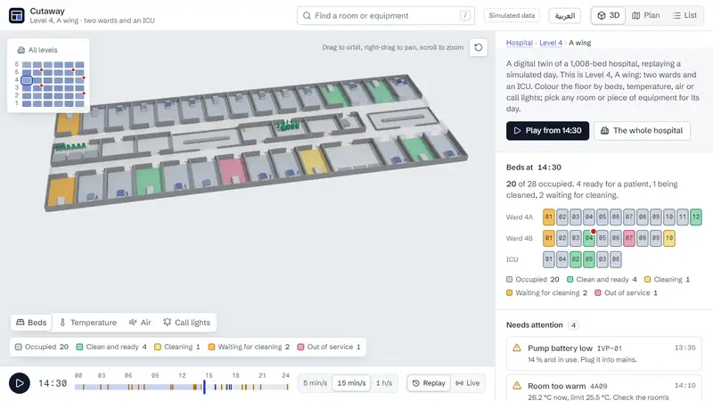

# Cutaway

[](https://github.com/imsemoo/cutaway/actions/workflows/deploy.yml)

A concept digital twin of a hospital, in the browser: six levels of six wings, with 1,368 rooms, 1,008 beds and 3,006 tracked pieces of equipment. It opens on one wing, two wards and an ICU on level 4, and replays a simulated day, or follows it live from a streaming feed: beds turning over from occupied to cleaning to ready, rooms warming up through HVAC faults, call lights waiting too long at shift change, and equipment moving between rooms.

Everything on screen is simulated. There is no real hospital, patient or reading behind it.

Cutaway was called Ward Twin until October 2026, when it had long outgrown one ward. The old address forwards here.



The full film, 58 seconds, goes on to the way to the nearest free pump, the whole hospital and a level, the interface in Arabic, and the twin inside another page that opens a room in it and hears its alerts: [film/cutaway-720.mp4](film/cutaway-720.mp4), captured frame by frame on a controlled clock by `tools/film`.

**Live:** https://imsemoo.github.io/cutaway/ (add `?stats` for a frame meter, or open [live mode](https://imsemoo.github.io/cutaway/?mode=live), [the Arabic interface](https://imsemoo.github.io/cutaway/?lang=ar) or [a real clinic read from its BIM model](https://imsemoo.github.io/cutaway/?building=clinic), or see it [inside another page](https://imsemoo.github.io/cutaway/host/))

## What it does

- **The whole hospital, a level, or a wing.** A map of the building sits beside the model: every wing by level, shaded by how full it is, with a mark where something critical is open.
  - "All levels" draws the six levels apart, an exploded section of the building, with every floor coloured by the same layers; a warm room or a stale lounge shows from across the hospital.
  - A level shows its six wings on one plate, joined by glazed links, in 3D or as one floor plan.
  - A click on a wing flies into it, and a trail above the panel leads back up: Hospital, Level 4, A wing.
- **3D, plan and list views of the same floor.** Plan view drops every wall to a section cut 15 cm above the floor and inks it, so the model turns into the architect's drawing without swapping scenes. List view is the same data as an accessible table.
- **Four data layers on the floors:** bed state, temperature, CO₂ and call-light wait time, each with its key. In temperature and CO₂ each room shows its own sensor, and the corridors, which have none, are estimated from the doors that open onto them, with isolines and a darker line at the alert limit: a warm room's heat shows spilling out of its door, and a stale lounge's air down the corridor.
- **A 24-hour replay** with play, three speeds and a scrubber marked with every alert.
- **Or live.** Live mode connects to a feed and builds the floor from events as they arrive. In the demo, a mock server in a Web Worker streams the simulated day at a simulated minute a second, over the JSON protocol a real integration server would use. The footer shows the connection. "Take the server down for 4 seconds" shows the recovery: retries back off, the stage says the floor is stale, and the missed events are replayed on reconnect.
- **Or from a hospital's systems.** `npm run hospital` runs a whole simulated hospital on one machine, and the clinic beside it: an MQTT broker, the building sensors, bed status, nurse call, location tags and patient flow publishing the day as raw messages, and an integration server for each building that works out the alerts itself and serves the feed the twin reads. `npm run dev:hospital` opens the twin on it. The topics, and how each real system maps onto one, are in [docs/integration.md](docs/integration.md).
- **The nearest free equipment, and the way to it.** From any bed, "Nearest free" finds the pump, wheelchair, bladder scanner or, in the ICU, ventilator that is quickest to reach on foot anywhere in the hospital, and draws the way on the floors with the walking time. When the nearest one is in another wing the view pulls out to the level, and to the whole hospital when the way takes a lift.
- **Pick anything:** click a room or a piece of equipment, or search for it with `/`. The camera flies to it and the side panel shows its day: bed states as a strip, 24-hour temperature and CO₂ charts with limits, call lights, and the equipment in the room.
- **In English or Arabic.** A switch in the top bar turns the whole interface to Arabic, right to left, and back; the choice is kept, and `?lang=ar` opens in Arabic.
  - The layout mirrors: the panel moves to the left of the model, the overlays swap sides, the back arrow and the trail turn around. Time and scales do not: the timeline runs left to right as in any media player, and so do the charts, the colour ramps and the map of the building, where the A wing stays west.
  - Room names are written in Arabic on the floors too, and the alerts are worded in Arabic at the minute on the timeline, with Arabic plurals: دقيقتان for two minutes, 3 دقائق, 11 دقيقة.
  - Digits stay Western, like the room numbers (4A09) and clock times they sit beside.
- **Every view is a link.** The address bar keeps the view, layer, time and selection, so `?view=plan&layer=air&t=18:00&select=FAM` opens the family lounge at its stuffiest hour, `?at=level-4` a whole level and `?at=hospital` the whole hospital.
- **Alerts that only know the present.** Each alert is worded at the replay minute ("Pressed at 14:21, 9 min without an answer"), so scrubbing never leaks what happens next.
- **Alerts an operator can answer.** Acknowledge an alert, then send it to the team that owns it: facilities for a warm room, nursing for a call light, housekeeping for a bed waiting to be cleaned, bed management for a clean bed with no patient. Each alert keeps a log in its room: opened, acknowledged and how long after, sent, cleared, or "Cleared after 1 min, never acknowledged". The alert clears when its condition does, not when someone clicks: as in alarm-management standards, acknowledging is the operator's and clearing is the data's. Scrub back before an acknowledgement and the alert is new again. Live, actions go through the server to every screen, and one taken while the server is down waits and arrives after.
- **The next four hours of ward beds.** Every overview forecasts how many ward beds will be free, net of the patients waiting for one, as a likely value and a range meant to hold four times in five, drawn beside the last four hours and, in replay, what the recorded day went on to do. A room whose patient the morning round expects to go home says when.
- **By keyboard and screen reader.** The model is one tab stop. The arrow keys move between rooms, or between wings in a level or the whole hospital, by what lies that way on screen; Enter opens one and Escape steps back out. Each move is said aloud ("Patient room 4A09, Occupied"), and so are the alerts that open while the day plays or streams live, a few seconds' worth at a time. The list view carries the same floor as a table, and every view a link opens passes axe's WCAG 2.2 A and AA checks at desktop and phone size on every push.
- **And a real building.** `?building=clinic` opens the twin on a real clinic's plan, read from its BIM model: buildingSMART's Medical-Dental Clinic, 259 rooms on two floors, every room, wall and door as its architects drew them, with a simulated day on its own rooms, replayed or live. The same layers, views, alerts and languages; both floors side by side, or one at a time. How it is read, and how to read another: [docs/buildings.md](docs/buildings.md).
- **Inside another page.** A dashboard adds the twin with one script and one tag, `<cutaway-twin at="level-4">`, opens it on any room, layer or minute, and hears what happens in it: what was selected, the alerts open, and each alert as it opens. [A mock operations page](https://imsemoo.github.io/cutaway/host/) shows it; [docs/embed.md](docs/embed.md) is the reference.

## How it is built

The whole system on one page is in [docs/architecture.md](docs/architecture.md); the reasons behind it, in [fourteen short decision records](docs/decisions/README.md); and how it got here, with the numbers measured before and after each change, in [the making of](docs/making-of.md).

- React 19, TypeScript, React Three Fiber, drei and three.js, bundled with Vite.
- **The day is generated in a Web Worker** from a fixed seed, so the scene's first frame never waits on the simulation and every visitor replays the same day.
  - Each wing is simulated from its own seed, so one wing's day never shifts another's. Level 4's A wing keeps a scripted story on top; the others draw their discharges, admissions and faults at random.
  - The wing on show arrives first, in under 30 ms, and the whole hospital follows in under a second (measured at 25 to 29 ms and 0.6 to 0.75 s on the laptop below).
- **One day, two sources.** Every view is a function of a day and a minute. Replay hands the views the recorded day. Live mode folds a stream of events into the same shape, where anything still going on (a bed's current state, a call light that is on, an open alert) ends at Infinity until an event closes it. No view needed to know which source it reads.
- **A feed that stays whole.** Every event carries a sequence number.
  - A gap, four silent seconds or a dropped connection all end in a new subscribe that asks only for the missed events. The server sends the whole day so far when it no longer holds them.
  - Reconnects back off from half a second, doubling to 15 s, at a random point in the upper half of each wait, so screens do not all come back at once.
  - Events are applied at most once a frame, so a catch-up burst costs one render.
  - Building with `VITE_FEED_URL=wss://…` points the same client at a real WebSocket server. The protocol is in [docs/live-feed.md](docs/live-feed.md).
- **A forecast checked against the day.** The balance of ward beds, clean beds less patients waiting, moves by beds coming out of cleaning and requests arriving, and nothing else: an admission takes one of each.
  - Each forecast draws 300 times how long the beds being turned over and the discharges the morning round planned will take, and how many requests arrive at the usual pace, seeded by the minute and the place so a view always shows the same one. The whole hospital takes 2.8 ms in Node.
  - It reads only what is known at the minute. A test builds it from the live feed up to a minute and from the whole recorded day, and they must be identical.
  - A backtest makes it every half hour in every wing and compares it with what the day did. Four hours ahead the range held 93.6 % of the time and the middle was off by 0.68 of a bed; over twelve other simulated days, the hospital as a whole held 80.0 %. The first version held 50 %, and the backtest found why ([the making of](docs/making-of.md)). `npm run backtest` prints the tables.
  - The simulation gained the discharge plans and bed requests a hospital would know ahead, from a random stream of its own, so the replayed day stayed as it was.
- **A building read from IFC at build time.** `npm run ifc:import` parses the clinic's 13 MB IFC file with web-ifc in Node and writes what the twin needs, 34 kB gzipped: each room's outline, cut from the lowest face of its own mesh, with its name, OmniClass category and stated area; wall footprints; doors with the rooms they join. The page never loads the IFC or the parser. A test holds every room's area to the model's own figure ([decision 15](docs/decisions/0015-a-real-building-read-at-build-time.md)).
- **An integration server, fed over MQTT.** It subscribes to one topic per room, asset and flow, checks every message, turns changes into the feed's numbered events, gathers readings into a frame every five minutes, and works out every alert from the raw data, by the same limits the simulation uses (`src/data/limits.ts`). It serves the feed through the same hub as the mock (`src/live/hub.ts`), so the twin needs only `VITE_FEED_URL`, and publishes an alert an operator sends to a team on that team's topic.
  - A test publishes the whole recorded day as the systems would, 1,005,153 messages, and the engine must turn them into exactly the recording's 21,904 events, all 881 alerts included, though it is given none of them. Another runs a broker, the server, a screen and a team end to end.
  - Writing the rules for live data found that the simulation flagged stale air at the first high reading, when the rule needs two; it now flags it at the second.
  - Messages go at QoS 1: at QoS 0 the broker dropped most of the day-so-far burst.
- **Actions through the feed.** An operator's action goes to the server as a message and comes back to every screen as an event, so all of them read the same log. It waits in an outbox until the server's log has it and goes again after a reconnect; the server logs it once, by its id.
- **Wayfinding over a graph of the building.** Nodes stand in every room, at its door, along both corridors of every wing, where the corridors meet through the core, along the glazed links between wings and rows, and at every lift. Costs are seconds: walking at 1.2 m/s, and a lift as a wait plus a few seconds a floor.
  - "Which free pump is nearest?" has many answers to weigh, so one Dijkstra search from the room reaches all of them at once, where A* would need a search per pump. The hospital's graph has 4,296 nodes; it is built once, in under 10 ms, and a search took 2 to 11 ms in Node.
  - The search loads on the first request, as its own 1.4 kB file, so the page does not carry it until someone asks.
- **On-demand rendering.** The canvas draws only when something changes: a camera move, a new minute, a hover. An idle ward costs no GPU time.
- **Models through a glTF pipeline.** Beds, patients, bedside furniture and five kinds of equipment are parametric models in code (`tools/models`).
  - `npm run models` merges each model's parts into one mesh, with vertex colours and a tint mask.
  - It welds and quantises the meshes, compresses them with meshopt, and writes one file: `public/models/ward.glb`, 129 KB for 17,208 triangles.
  - The loader and decoder arrive after the first frame, so the scene opens on simple proxies and the detail streams in.
- **Corridor fields in the fragment shader.** Walls keep one room's air from another's, so the rooms stay flat at their own readings, and only the corridors are interpolated: inverse distance weighting over the wing's 38 doors, each weighted by its width, since a wide opening moves more air.
  - Every wing is built to one plan, so the doors are one uniform array for all 36 wings. The readings sit in a 38 × 36 float texture, a row per wing, which the shader reads with `texelFetch`; a new minute uploads 1,368 numbers, not geometry.
  - Isolines every half degree or 100 ppm, and the limit line, come from screen-space derivatives, and fade before they would crowd into a moiré from far away.
  - Switching the layer back and forth on one page, orbiting at the top quality level, cost 1 or 2 fps.
- **One draw call per model, with tinted parts.** A small shader patch applies each instance's colour only where the tint mask says so: a blanket shows the patient's acuity and a pump's housing its status, while the frame and the pole keep their own colours.
- **Instanced at hospital scale.** Every wing is built to one plan, so each part of the shell (walls, glass, counters, lifts) is one instanced mesh for all 36 wings; so are the glazed links between them, and the 1,368 room floors are one more. Only what is in scope is packed into the instances drawn, so a wing out of view costs nothing, not even its vertices. The whole hospital draws in 33 draw calls.
- **Per-instance level of detail.** Every instance picks its detailed model or its proxy by its distance from the point the camera looks at, with hysteresis, across two instanced meshes. Detail goes where the eye is: a wing's overview draws 15k triangles and a close-up about 130k, and in the whole-hospital view equipment drops to plain boxes.
- **Batching.**
  - All 38 room floors are one instanced mesh and the pick target.
  - The walls, glass and fixtures are merged geometry.
  - The 38 room labels are two batched text meshes, one per typeface.
- **Shadows on demand.** The sun and the building never move, so the shadow map is redrawn only when something that casts a shadow does: walls rising, a bed filling, a pump rolling to another room. Orbiting the camera reuses it.
- **Adaptive quality.** Four levels, from ambient occlusion with SMAA down to plain rendering at a pixel ratio of 1.
  - The frame rate is watched only while something moves.
  - After a slow window the level steps down, and it steps back up after smooth ones.
  - It stops flipping after four changes, so a device on the edge settles.
  - `?quality=0` to `3` pins a level.
- **Context loss recovery.** If the GPU driver resets, the scene says it has paused, and the canvas is rebuilt from scratch when the context comes back. A browser test forces a loss and checks the recovery.
- **Arabic without weight for English readers.** English is the key: every string is written in English where it is used and passed through `say()`, so the code reads as it did. The Arabic catalogue is its own 6 kB file, fetched only when Arabic is chosen, and Vazirmatn, the Arabic face, is declared for Arabic letters only, so an English visit never downloads it.
  - Vazirmatn was picked by setting the interface's own text in six Arabic faces beside Schibsted Grotesk: it matches the grotesk's size and calm, and keeps the panel's line spacing.
  - Counts go through `Intl.PluralRules`, which gives Arabic its six forms. Placeholders are named, so each language puts the number where its grammar wants it.
  - The floor labels are troika text in Vazirmatn, which shapes and joins Arabic in WebGL.
  - A test parses the source with the TypeScript compiler, collects every string passed to `say()` and `plural()`, and fails if the catalogue misses one, drops a placeholder or keeps a string the interface no longer says.
- **An embed kit.** `embed.js`, 1 kB gzipped, defines `<cutaway-twin>`, which runs the twin in an iframe and speaks a small `postMessage` protocol with it, in the words a link already uses: `at`, `select`, `layer`, `t`.
  - The twin announces itself, the host connects, and from then on the twin takes commands only from that origin and posts only to it. A build can name the only hosts allowed, with `VITE_EMBED_ORIGINS`.
  - Commands are checked by the same function that reads a link; one it cannot take comes back as an error and changes nothing.
  - The twin's side loads only when it runs in a frame.
- **Code-split by weight.** What paints the interface loads first: 89.7 kB gzipped, the entry chunk and the small chunks it imports, which the budget counts together. The alert list, the forecast and a room's or a piece of equipment's details follow as soon as it has painted, since none of them can show anything before the day arrives. Live mode and the list view load when someone opens them, and the clinic's page only on its own link (11.5 kB, and its 34 kB plan). The scene and three.js follow (217 kB and 99 kB), then the model loader (20 kB). Ambient occlusion and SMAA load last, and only when the quality level uses them (157 kB, a third of it SMAA's lookup texture). CI enforces a budget for every chunk and for the first load.
- **The camera fits the building by projection:** it projects the floor's corners through a trial camera to find the distance and offset that keep the model clear of the overlays, and turns the building lengthwise on tall screens.
- Reduced motion turns camera flights and the wall animation into cuts.

## Measured

Measured on an integrated Intel UHD GPU at 1280 × 800 and a pixel ratio of 1.25, orbiting continuously (`?stats=orbit`), at the top quality level (ambient occlusion and SMAA), over three runs in one session. The laptop's own load moved the rate by up to 16 fps between runs, so each view gets its range:

| View | Frame rate | Draw calls | Triangles |
|---|---|---|---|
| A wing | 69 to 81 fps | 43 | 15k |
| Close to a room | 61 to 77 fps | 48 | 128k |
| A level, six wings | 74 to 90 fps | 33 | 81k |
| The whole hospital | 72 to 90 fps | 33 | 175k |

The whole hospital, with all of its 1,368 rooms, 1,008 beds and 3,006 pieces of equipment on screen, draws in fewer calls than one wing up close: far away the equipment is boxes, and the detailed meshes are empty. Without ambient occlusion (quality level 1) every view reached the display's 144 Hz, in 17 to 31 draw calls. Left to itself, adaptive quality stayed at the top level on this machine.

The on-screen meter (`?stats`) shows the frame rate while moving, draw calls, triangles and the quality level. A real low-end phone is still to be measured.

## Tests

- `npm test` runs 113 unit tests on the hospital plan, the simulation, the queries, the alert wording and handling, the live feed, the integration server, the forecast, the wayfinding, the corridor field, the Arabic catalogue, the embed bridge and the keyboard cursor:
  - six levels of six wings, with unique ids, every room inside its wing and no two rooms overlapping;
  - the same seed gives the same day, and every wing a day of its own;
  - more than 3,000 pieces of equipment, each only ever inside its own wing;
  - every bed has exactly one state at every minute;
  - a vacated bed turns over in order;
  - alerts never word the future;
  - rooms never overlap, and no two pieces of equipment share a spot;
  - the 14:30 story the case study describes still holds;
  - the day rebuilt from the event log, batch by batch, reads exactly like the recording at every five-minute reading, and holds nothing from later in the day;
  - the connection resumes after a drop, asks again after a gap, drops a silent link and backs off with jitter;
  - the integration server's engine turns the whole day's device messages into exactly the recorded event log, the hospital's and the clinic's, each by its own rules, and the server, a broker, a screen and a team work end to end, for each building on its own feed;
  - the feed's server side gives a new screen the day so far and a returning one only what it missed, and logs an action once;
  - an action is sent once the feed is up, held while it is down, sent again after a reconnect unless the log already has it, folded in once however often it arrives, and dropped when the day ends;
  - how an alert is handled at a minute knows nothing done after it, and its log clears only once its condition does;
  - the forecast starts from the balance now, is the same from the live feed as from the recording, counts a planned discharge only from when it was noted, and holds its range in the backtest;
  - every room reaches every other; a way follows corridors and links, crosses to the next wing, the other row or another level when it must, and counts a lift ride in time but not in metres;
  - every room has a door on a corridor, and every wing matches the plan room for room, so the shader finds each reading where it looks;
  - the Arabic catalogue covers every string the code says, with the same placeholders and nothing stale, and counts by Arabic's plural rules;
  - the embed bridge talks only to the page that connected, takes what a link takes and refuses the rest by name, reports an alert opening only while the clock runs forward, words alerts in the language on show, and reports the clock alone at most once a second;
  - an arrow key steps to the nearest room that way on screen, keeping to the row, and nowhere when nothing lies within 60 degrees of it;
  - the clinic's building file matches its IFC model: its rooms per storey, every room's area within 10 % of the model's own once the walls it is measured to are counted, labels inside their rooms, and re-importing gives the same file;
  - the clinic's day accounts for every minute of every care room, rings call lights only with a patient in, and has the afternoon its overview describes.
- `npm run test:e2e` runs 30 browser tests at desktop and phone size, with real WebGL. They cover shared links, layers, the list view, search, playback, sideways scroll, recovery from a lost WebGL context (also when the effects arrive after the loss), live mode through a server outage, an alert acknowledged and sent and new again before that minute, one sent while the live server is down, the forecast in every overview, the whole hospital, a level and a wing, the panel opening each new place at its top, the way to the nearest free pump, the Arabic interface (right to left, remembered, and read from a link), the twin embedded in a page on another origin that moves it and hears it, the model driven from the keyboard, an alert said aloud as it opens, and the clinic, from the hospital's link to a room picked on its board, one floor at a time, its plan and list views, in Arabic, and live from its own feed with an alert acknowledged there. Every test fails on a console error. Then, as a stage of its own, axe-core checks twelve views against WCAG 2.2 A and AA at both sizes.
- `npm run check` runs types, lint, the unit tests, the build and the bundle budget. CI runs all of it, plus the browser tests, before every deploy; a failing check blocks the deploy.

## Run it

```bash
npm install
npm run dev
```

`npm run hospital` and, beside it, `npm run dev:hospital` run the twin on a simulated hospital over MQTT ([docs/integration.md](docs/integration.md)). `npm run build` writes a static site to `dist/`. `npm run models` rebuilds the model file, and `npm run check` runs every check CI runs except the browser tests.

## Credits

Concept, design and code by [Islam Nasser](https://imsemoo.github.io/eslam-portfolio/). Type: Schibsted Grotesk and Fragment Mono, both under the SIL Open Font License. Icons: Lucide.
