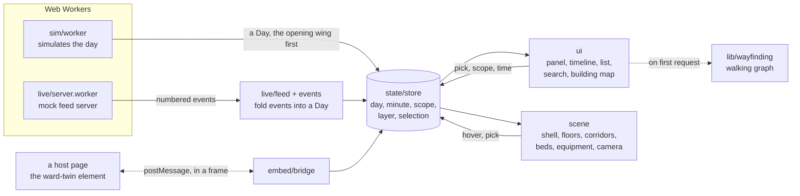

# Architecture

Ward Twin is a single-page app with no server of its own. A simulated day, or a live feed, becomes one data structure, the `Day`; every view on screen is a function of that day and a minute. The DOM interface and the 3D scene read the same store, and neither knows whether the day was recorded or is arriving live.

## Folders

| Folder | What it holds |
|---|---|
| `data` | The hospital: six levels of six wings, all built to one plan, and the `Day` types. |
| `sim` | The simulation of a day, seeded per wing, and the worker that runs it. |
| `live` | The feed protocol, the event log and its fold into a `Day`, the client with resume and backoff, and the mock server. Loaded only in live mode. |
| `state` | The store (zustand), the scope (hospital, level or wing) and the adaptive quality level. |
| `lib` | Queries over a day at a minute, alert wording, colours, equipment positions, wayfinding. |
| `scene` | Everything in the canvas: the instanced shell, floors and corridors, the models, level of detail, the camera, effects, shadows, the tracker that places the tags, and the keyboard cursor ([decision 11](decisions/0011-the-model-is-one-keyboard-widget.md)). |
| `ui` | Everything around the canvas: the top bar, the panel, the timeline, the layer switch and key, the list view, the tags, the building map. |
| `i18n` | `say()` and `plural()`, and the Arabic catalogue. |
| `embed` | The protocol a host page speaks with the twin in a frame, the bridge on the twin's side, and the `<ward-twin>` element built into `embed.js` for the host ([decision 10](decisions/0010-embed-through-an-iframe.md), [embed.md](embed.md)). |

## The data

A `Day` holds, for every room, its bed states as spans and its temperature and CO₂ as readings every five minutes; the call lights; every piece of equipment as spans of where it was and in what state, with a battery for the pumps; and the alerts, each with what was known when it opened. A view asks for the state at a minute, `bedAt(day, room, t)` or `sample(series, t)`, and never looks past it, which is why nothing on screen gives away what happens later.

The story wing, level 4's A wing, keeps a scripted afternoon; the other 35 are simulated from their own seeds. The day covers 1,368 rooms, 1,008 beds and 3,006 pieces of equipment.

## The scene

- **Frames on demand.** Nothing is drawn unless something changed ([decision 1](decisions/0001-render-on-demand.md)).
- **One plan, instanced.** Every part of the shell is one instanced mesh for all 36 wings; only the wings in scope are packed into what is drawn ([decision 2](decisions/0002-one-plan-instanced.md)).
- **Models through glTF.** Beds, patients, bedside furniture and five kinds of equipment are generated in code (`tools/models`), compressed with meshopt, and drawn as instances with a shader that tints only the parts that carry state.
- **Level of detail per instance.** Each instance switches between its model and a proxy by its distance from the point the camera looks at, with hysteresis; in the whole-hospital view equipment is a box.
- **Corridor fields.** Temperature and air estimate the corridors from the doors, in the fragment shader ([decision 7](decisions/0007-corridors-not-walls.md)).
- **Shadows on demand, quality that adapts.** The shadow map is redrawn only when something that casts a shadow moves. Four quality levels, from ambient occlusion with SMAA down to plain rendering at a lower pixel ratio, step by the frame rate measured while the scene moves. A lost WebGL context pauses the view and rebuilds it.
- **Tags in the page.** Labels are DOM elements, placed from the scene on each drawn frame ([decision 5](decisions/0005-dom-tags.md)).

## Loading

| Chunk | Gzipped | When |
|---|---|---|
| Entry and the three small chunks it imports | 90.8 kB | first, before the interface paints |
| Scene | 215 kB | after the interface has painted |
| three.js core | 99 kB | with the scene |
| glTF loader and meshopt | 20 kB | with the models |
| Effects (ambient occlusion, SMAA) | 157 kB | only at the quality levels that use them |
| Arabic catalogue | 5.9 kB | when Arabic is chosen |
| Live mode | 2.1 kB | when live mode is turned on |
| List view | 1.3 kB | when the list view is opened |
| Wayfinding | 1.4 kB | on the first request for a way |
| Embed bridge | 1.3 kB | only when the twin runs in a frame |
| Alerts read aloud | 0.9 kB | after the interface has painted |
| `embed.js`, the `<ward-twin>` element | 1.0 kB | on the host's page |

The day itself is computed in a worker ([decision 3](decisions/0003-simulate-in-a-worker.md)). Every chunk and the first load have budgets that block the deploy ([decision 9](decisions/0009-budgets.md)).

## Tests

- 66 unit tests (Vitest): the plan, the simulation, the queries and alert wording, the live feed and its fold, the wayfinding graph, the corridor field's data, the Arabic catalogue, the embed bridge in a fake frame, and the keyboard cursor's steps.
- 21 browser tests (Playwright), each at desktop and phone size with real WebGL, and each failing on any console error. One embeds the twin in a page on another origin; one drives the model from the keyboard.
- axe-core checks of eight views against WCAG 2.2 A and AA, at both sizes, run as a later stage so their weight never crowds the timing-sensitive live-mode test.
- Types, lint and the bundle budgets. CI runs all of it before every deploy to GitHub Pages.

## Decisions

The decisions behind the design, each with its context and consequences, are in [decisions](decisions/README.md). How it got here, with the numbers measured before and after each change, is in [the making of](making-of.md).
