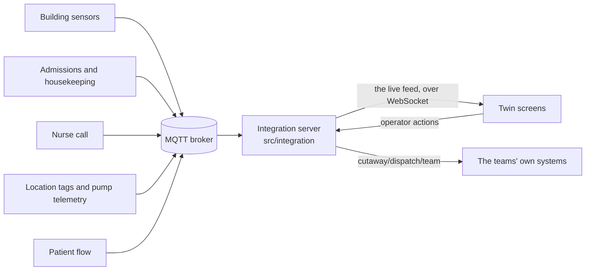

# Connecting a hospital

The live feed ([live-feed.md](live-feed.md)) is the twin's one door to live data. This page is about what stands on the other side of it in a hospital: the systems that know what is happening, and the integration server that turns what they say into the feed.



Each system publishes small JSON messages on MQTT, the publish-and-subscribe protocol most building and device gateways speak. The integration server subscribes, checks each message, works out the alerts from the raw data, and serves the result to every screen. Why a server in between, rather than the browser reading MQTT directly, is [decision 14](decisions/0014-an-integration-server-between-the-systems-and-the-twin.md).

## Running it

```bash
npm run hospital
```

starts a whole simulated hospital on this machine, and the clinic beside it: an MQTT broker on port 1883, an integration server for each building (the hospital's feed on 8787, the clinic's on 8788), and both buildings' systems replaying their recorded days as raw messages, a simulated minute a second from 14:30. `--start 06:00` and `--rate 5` change both; `--port` and `--clinic-port` move the feeds. Then, in a second terminal:

```bash
npm run dev:hospital
```

serves the twin on port 5182 with `VITE_FEED_URL=ws://localhost:8787` and `VITE_CLINIC_FEED_URL=ws://localhost:8788` (from `.env.hospital`); open http://localhost:5182/?mode=live for the hospital, or http://localhost:5182/?building=clinic&mode=live for the clinic. Any build pointed at the servers works the same way: `VITE_FEED_URL=wss://… npm run build`.

The day so far, 612,883 messages from the hospital and 47,810 from the clinic to 14:30, goes out at once, as from systems that have been running all day; it takes about 20 seconds on the laptop the numbers in this repository come from. Every ten seconds each server says what has come in and gone out:

```
Hospital feed 907.0 min: 637,345 messages in, 0 dropped, 15,802 events logged, 1 screens
Clinic feed   907.0 min: 49,785 messages in, 0 dropped, 1,940 events logged, 1 screens
```

## The topics

Every payload carries `at`, the minute of the day it happened, 0 to 1440. Room ids are the rooms of `src/data/floorplan.ts`; asset ids are free text. The types are in `src/integration/topics.ts`.

The topics below are the hospital's, under the root `cutaway`. Each building publishes under a root of its own, and a server serves one building, a site (`src/integration/sites.ts`): the clinic's systems publish the same topics under `cutaway/clinic` (`cutaway/clinic/bms/1A15`, `cutaway/clinic/clock`), about the clinic's own rooms, and its server answers on a feed of its own ([decision 16](decisions/0016-a-feed-for-each-building.md)). The clinic has no location tags, pumps or patient flow, so it publishes building sensors, room status, nurse call and the clock.

| Topic | Payload | Sent | In a hospital, from |
|---|---|---|---|
| `cutaway/bms/<room>` | `temp` (°C), `co2` (ppm) | every five minutes | The building management system, through a BACnet or Modbus gateway |
| `cutaway/beds/<room>` | `state` (occupied, dirty, cleaning, ready, blocked), `acuity`, `note` | on change | Admissions, discharges and transfers (HL7 ADT through an interface engine) and the housekeeping system |
| `cutaway/nursecall/<room>` | `on`, `pressed` (the minute it was pressed) | on change | The nurse call system |
| `cutaway/rtls/<asset>` | `kind` (pump, vent, chair, xray, scanner), `loc` (a room), `status` (in-use, available, needs-cleaning, charging) | on change | Location tags, with the status from asset management |
| `cutaway/telemetry/<asset>` | `battery` (%) | every five minutes | The pumps' own device integration |
| `cutaway/flow/request/<id>` | `wing`, `waiting`, and `room` once a bed is given | on change | Bed management: requests from ED, theatre and other wards |
| `cutaway/flow/plan/<room>` | `eta` (the minute the patient is expected to go) | when the round notes it | The board round's expected discharges |
| `cutaway/clock` | | every minute | In the demo, the simulated clock. A deployment uses the server's own |

And one the server publishes:

| Topic | Payload | Sent | For |
|---|---|---|---|
| `cutaway/dispatch/<team>` | `id`, `alert`, `team`, `by` | when an operator sends an alert to a team: nursing, housekeeping, facilities or bed-management | The team's own system: a cleaning task, a maintenance work order, a page to the nurse in charge |

Messages go at QoS 1, so the broker delivers each one and the server acknowledges it. The first version sent at QoS 0: ten seconds after the 612,883 messages of the day so far had gone out, the server had received 24,829, because the broker drops what a subscriber cannot take as fast as it comes. The floor showed one occupied bed.

## What the server does

- **Checks every message.** One without a minute, about a room its building does not know, or with a state it does not know is dropped and counted.
- **Passes changes on as events.** A system that repeats a bed's status unchanged has not changed anything, and the server says nothing.
- **Gathers readings.** Readings go out every five minutes as one frame for the whole hospital, each room at its latest value, so a room whose sensor missed a reading keeps its last one.
- **Works out the alerts**, by the same rules and limits the simulation records the day with (`src/data/limits.ts`). An alert opens at the minute the data first shows it and closes when the data shows it over:

  | Alert | Opens when | Closes when |
  |---|---|---|
  | Room too warm | a reading is above 25.5 °C (the screen calls it critical above 26.5 °C) | a reading is back under |
  | Air getting stale | two readings in a row are above 1,000 ppm | a reading is back under |
  | Call light unanswered | it has been on 5 minutes (critical at 10, on the screen) | it goes off |
  | Bed waiting for cleaning | it has been dirty 60 minutes (the hospital only) | its status changes |
  | Clean bed not assigned | it has been ready 120 minutes, having become ready today (the hospital only) | its status changes |
  | Pump battery low | a pump in use reports under 20 % | it reports 20 % or more, or is no longer in use |

- **Logs operators' actions** once each, by id, sends them to every screen, and publishes an alert sent to a team on that team's topic.
- **Starts a new day** when the clock goes back, and every screen starts over.

A ward's turnover is a question for bed management, so the hospital flags a bed left dirty or a clean one left empty. The clinic does not: an exam room standing empty is an ordinary thing, and its turnover shows on the floor instead.

## How it is checked

- `src/integration/engine.test.ts` publishes the whole recorded day as the systems would, 1,005,153 messages, and runs them through the engine. What comes out must be exactly the recording's event log, 21,904 events, every one of its 881 alerts included, though the engine is given none of them: it works each one out. Nothing may be dropped, and the events must come out in order of time.
- The same test publishes the clinic's whole day under its own root, 78,452 messages, through an engine for the clinic: out must come exactly its recorded log, 2,730 events with its 11 alerts, and none for rooms left waiting to be turned over, though some wait more than an hour.
- `src/integration/server.test.ts` runs a broker, the server, a screen speaking the feed protocol and a team listening on MQTT, on free ports. The story wing's systems publish their day to 14:30; the screen must read the same open alerts and beds as the recording, an alert it sends to facilities must reach the team once, and a repeat of the same action must change nothing. A connection that sends anything but the feed protocol is closed. A second server, for the clinic, serves its systems' day to 14:30 to a screen that must read the same open alerts and rooms as the clinic's recording, and nothing of the hospital.
- `src/live/hub.test.ts` checks the protocol's server side, which the mock and the integration server share: the day so far for a new screen, only what was missed for a returning one, events appended in order, actions logged once and only about an alert that has opened, and a new day for everyone.

## What a hospital would add

These are not built here.

- **Gateways for each system.** An interface engine turning HL7 ADT messages into bed status, a BACnet gateway for the sensors, the location and nurse call vendors' own MQTT or API bridges.
- **Identity and transport security.** The server does no authentication. A deployment puts it behind the hospital's gateway, with TLS on both sides (`mqtts://`, `wss://`), and names each screen and operator rather than a random screen id.
- **A durable log.** The day's log lives in memory, so a restart starts the day over. A deployment keeps it in a stream that survives one, and replays from it.
- **Its own clock.** The demo's devices publish the simulated minute. A deployment takes the server's clock, in the hospital's time zone, and stamps each message with when it was received as well as when it happened.
